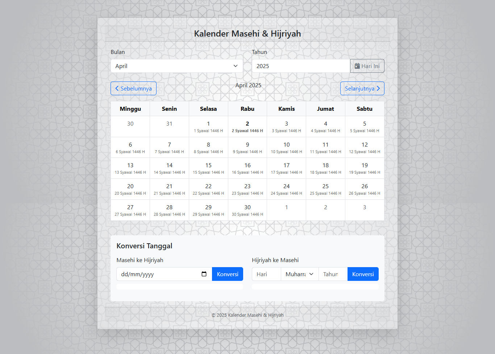

# Kalender Masehi & Hijriyah

Sebuah website sederhana untuk menampilkan kalender Masehi dan Hijriyah secara bersamaan dengan fitur konversi tanggal antara kedua sistem kalender.

## Fitur

- Menampilkan kalender Masehi dan Hijriyah secara bersamaan
- Navigasi bulan dan tahun
- Konversi tanggal dari Masehi ke Hijriyah
- Konversi tanggal dari Hijriyah ke Masehi
- Penyesuaian tampilan tanggal Hijriyah (-2 hari)

## Teknologi

- HTML5
- CSS3 (Bootstrap 5 & Tailwind CSS)
- JavaScript
- Intl.DateTimeFormat API

## Cara Menggunakan

1. Clone repositori ini atau download file ZIP
2. Buka file `index.html` di browser
3. Gunakan dropdown atau tombol navigasi untuk berpindah bulan
4. Untuk konversi tanggal:
   - Masukkan tanggal di form yang sesuai
   - Klik tombol "Konversi"

## Catatan

- Penyesuaian -2 hari pada tampilan Hijriyah bersifat statis
- Untuk keperluan resmi, disarankan menggunakan sumber kalender resmi

## Screenshot

## Lisensi

Proyek ini open source dibawah lisensi MIT.